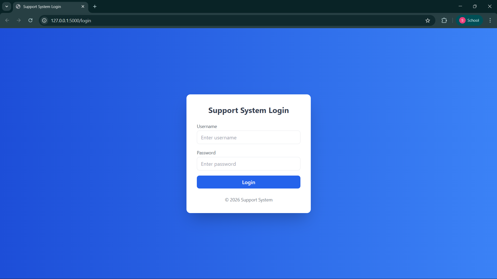
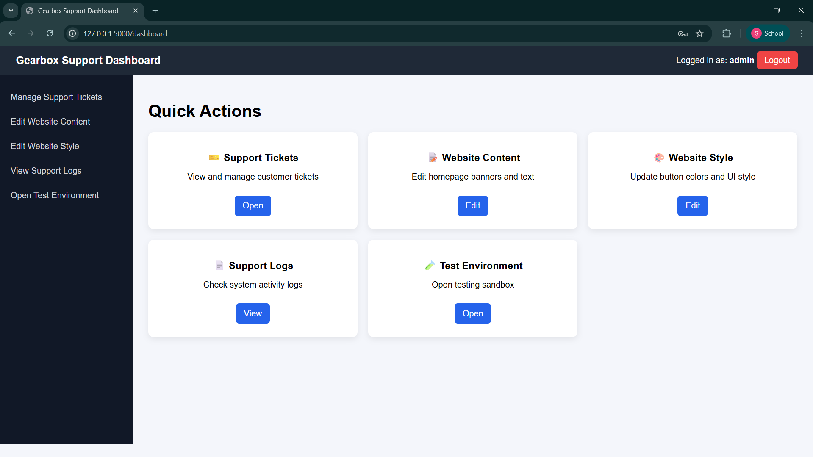
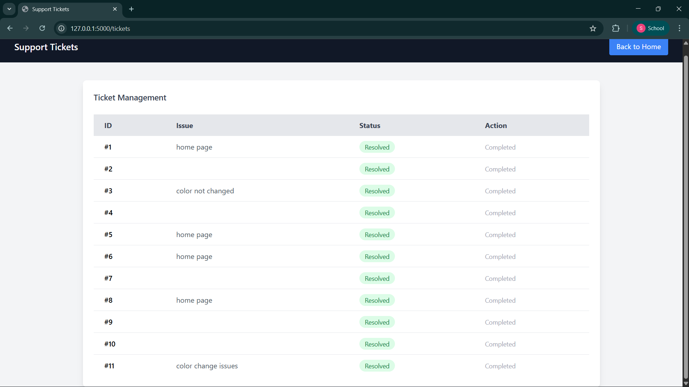
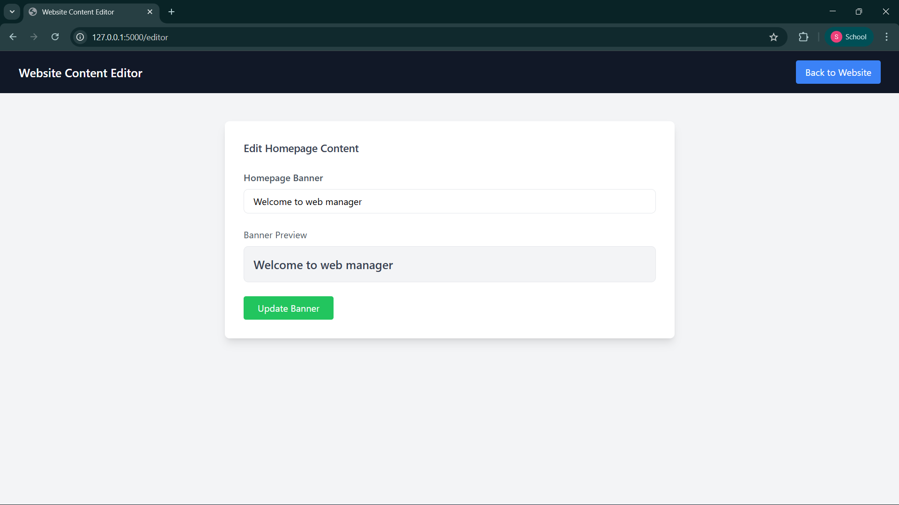
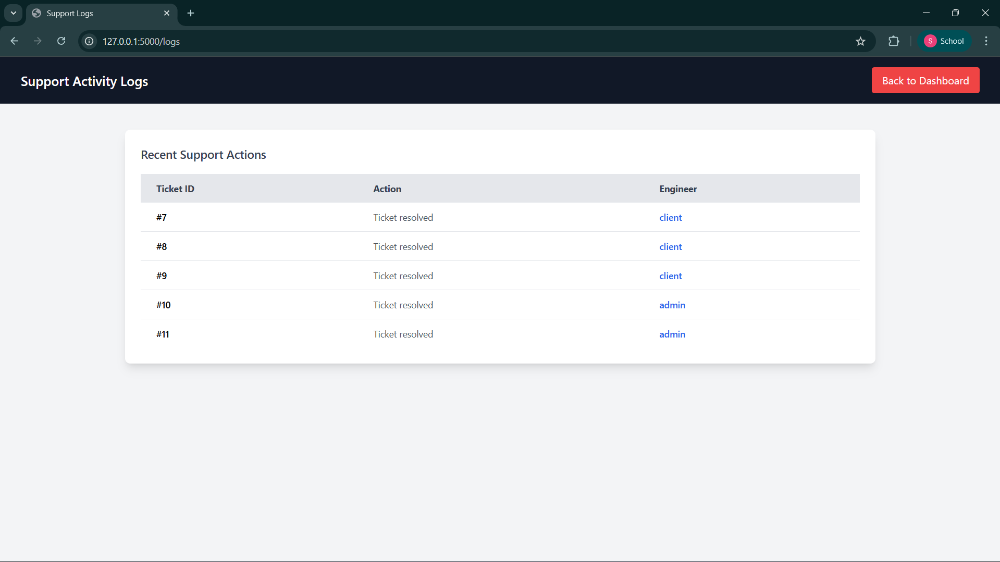

# Website Support & Ticket Management System

A SaaS-style platform that simulates **Tier-1 Website Support operations**.
This system allows support engineers to manage tickets, update website content, modify UI styles, and maintain support logs through a centralized dashboard.

---

## 🚀 Features

### 🎫 Ticket Management

* Create support tickets
* Resolve tickets
* Track ticket status (Pending / Resolved)

### 🖥 Support Dashboard

* Central dashboard for support engineers
* Quick access to operations and tools

### ✏ Website Content Editor

* Update homepage banner text
* Simulates CMS-based content updates

### 🎨 Style Editor

* Modify UI elements such as button colors
* Preview UI changes before applying

### 📜 Support Logs

* Tracks ticket resolution actions
* Maintains history of support activities

### 🔐 Role-Based Authentication

* Admin
* Support Engineer
* Client

### 🧪 Test Environment Mode

Access test mode using:

/?test=true

Allows previewing changes before deployment.

---

## 🛠 Tech Stack

Backend
Python (Flask)

Frontend
HTML
Tailwind CSS
JavaScript

Database
JSON Files

---

## 📂 Project Structure

website-support-system

app.py
tickets.json
users.json
logs.json
content.json
style.json

templates/
index.html
dashboard.html
login.html
tickets.html
editor.html
style_editor.html

static/
styles.css

screenshots/

---

## 📸 Screenshots

### Login Page

(

### Support Dashboard

)

### Ticket System

### Style Editor

### Support Logs

---

## 🔑 Demo Login Credentials

Admin
username: admin
password: admin123

Support
username: support
password: support123

Client
username: client
password: client123

---

## ⚙ How to Run

Clone repository

git clone https://github.com/yourusername/website-support-system.git

Go to project folder

cd website-support-system

Install dependencies

pip install flask

Run server

python app.py

Open browser

http://127.0.0.1:5000

---

## 📈 Future Improvements

* Ticket priority system
* Search and filtering
* Analytics dashboard
* Email notifications
* AI ticket classification

---

## 👨‍💻 Author

Developed by **Bittu**

Computer Science Engineering Student
Interested in Web Development and SaaS Platforms
